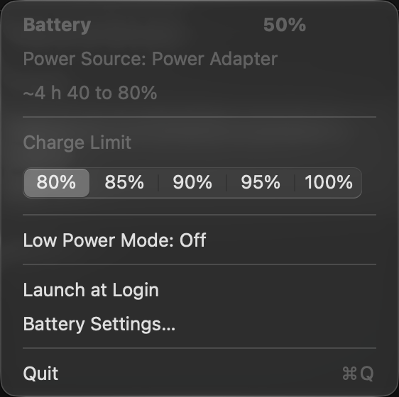

# macos-charge-limit

A small macOS menu bar app to read and change the built-in **battery charge
limit** — 80 / 85 / 90 / 95 / 100 % — without opening System Settings.

<p align="center">
  
</p>

It replaces the macOS battery menu — same drawn gauge in the menu bar — so you
can turn Apple's own battery icon off and stop having two of them side by side.
The menu itself is three rows: a status line, the charge-limit segments, and a
row of icons (prevent sleep, keep the screen on, Low Power Mode, launch at
login, settings, quit).
Everything else — power source, sleep coverage, who else is keeping the Mac
awake — lives in tooltips, on hover.

## Why

macOS 26.4 turned the old "80 % limit" switch into a real setting with five
levels, buried in **System Settings → Battery → ⓘ next to Charge**. That is four
clicks away and gives no at-a-glance readout. This puts it in the menu bar.

## Requirements

- An Apple silicon Mac with a battery
- macOS 26.4 or later (earlier versions only had the on/off 80 % toggle)
- Command Line Tools. **Xcode is not required.**

## Install

```bash
git clone https://github.com/laatortuejaune/macos-charge-limit.git
cd macos-charge-limit
./build.sh
cp -R BatteryLimitMenu.app ~/Applications/
open ~/Applications/BatteryLimitMenu.app
```

Enable *Launch at Login* from the app's own menu if you want it to stick around.

## Updating

```bash
cd macos-charge-limit
git pull
./build.sh
pkill -f 'BatteryLimitMenu.app/Contents/MacOS'
open BatteryLimitMenu.app
```

The `pkill` line is the one people skip. `build.sh` replaces the bundle but never
touches the process already running from it, and `open` will not start a second
one — it just activates the copy that is already there. Skip the quit and you
keep running the old build while believing you upgraded.

Nothing else needs redoing: the bundle path does not change, so *Launch at Login*
survives an update even though the code signature changes with every build.

The app is ad-hoc signed, not notarized — fine when you build it yourself, but
macOS will complain if you move a prebuilt copy between machines.

---

## How it works

This is the part worth reading. The charge limit is **not** exposed anywhere
obvious, and every documented route is a dead end.

### What does not work

Verified empirically on macOS 27.0, not assumed:

| Route | Result |
| --- | --- |
| `ioreg -rc AppleSmartBattery` | Nothing. All ~60 properties dumped. `MaxCapacity` is battery *health*; `CarrierMode` is shipping mode. |
| `ioreg -rc AppleSmartBatteryManager`, `IOPMPowerSource` | Nothing. |
| `system_profiler SPPowerDataType` | Nothing. |
| `pmset` | Cannot read or write it. |
| Configuration profile / MDM | No key for it. |

The reason all of these fail is the same: **the charge limit is not a property of
the hardware.** It is application state owned by a daemon.

### The actual mechanism

Internally the setting is called **MCL — Maximum Charge Level**. It lives in the
PowerUI daemon, reachable over XPC through a private framework:

```
System Settings ─┐
this app         ├─► PowerUISmartChargeClient ──XPC──► PowerUI daemon ──► charge controller
Shortcuts action ┘      (PowerUI.framework)
```

The app takes the exact path System Settings takes. **No root, no helper tool, no
kext, no SMC writes** — because the privileged party is the daemon, not us. We
are not asking for permission to write the SMC; we are asking an already
authorised system service to do it.

`PowerUISmartChargeClient` lives in
`/System/Library/PrivateFrameworks/PowerUI.framework`, which exists only inside
the dyld shared cache — so it cannot be linked against, only `dlopen`ed and
reached through the Objective-C runtime.

| Purpose | Selector |
| --- | --- |
| Create the client | `-initWithClientName:` |
| Is it available? | `-isMCLSupported` |
| **Read the limit** | `-getMCLLimitWithError:` → `unsigned char` |
| **Write the limit** | `-setMCLLimit:error:` |
| Offered levels | `-availableChargeLimitsWithError:` → `(80, 85, 90, 95, 100)` |
| Change signal | Darwin notification `com.apple.powerui.smartchargestatuschanged` |

The levels are asked for rather than hardcoded, so the menu follows if Apple ever
changes them. The Darwin notification fires whichever app made the change, which
is what keeps the menu bar in sync with System Settings for free — no polling.

### Five traps

**1. `-init` returns a mute client.** It succeeds and hands back a perfectly live
object, but with no XPC connection: every call answers `false` / `0` / empty
array, and the `NSError` is left `nil`. Silent, and easy to mistake for "the
machine doesn't support it". Only `-initWithClientName:` sets up the connection.

**2. `currentChargeLimit:` is not the setting.** It reports the limit *in effect
right now* and reads 100 whenever the machine is unplugged. Only
`-getMCLLimitWithError:` tracks what the user chose. This was confirmed by
changing the value in System Settings and watching which key moved.

**3. 100 % means "no limit".** Writing 100 disables MCL
(`-isMCLCurrentlyEnabled:` drops to 0), but `-getMCLLimitWithError:` still
returns 100 — so a single key is enough to drive the whole UI.

**4. `@main` on an `NSApplicationDelegate` starts the run loop without assigning
the delegate.** The app runs, mute and invisible, with no error anywhere. Hence
the explicit entry point in [`App.swift`](Sources/BatteryLimitMenu/App.swift).

**5. `unsafeBitCast` to an `@objc` protocol checks nothing.** It is the neat way
to call a class you cannot link against, but the compiler stops helping: if any
selector is missing the message still goes out, and the process dies on
`NSInvalidArgumentException: unrecognized selector`. Since every selector here
belongs to a private framework that can change without notice, the client is
built only after `-respondsToSelector:` has cleared **all** of them. Miss one and
the client is `nil`, which the UI already knows how to present.

### Time remaining, and why it has to be computed

Two more things had to be measured rather than assumed. The probe used for it is
[`Tools/power-probe.swift`](Tools/power-probe.swift).

**No system counter targets the charge limit.** `AvgTimeToFull` always counts to
100 %, whatever the limit is set to. Flipping the limit 80 → 100 → 80 during an
actual charge moved it by exactly zero minutes:

```
17:44:51  limit 80    54%   AvgTimeToFull = 117 min
17:45:06  limit 100   54%   AvgTimeToFull = 117 min
17:47:51  limit 100   56%   AvgTimeToFull = 118 min
17:48:06  limit 80    56%   AvgTimeToFull = 118 min
```

**`IOPowerSources` returns nothing on macOS 27.** `Time to Empty` and `Time to
Full Charge` both read `-1` permanently, on battery and while charging; `pmset`
agrees, printing `no estimate`. Only `AppleSmartBattery` in the IORegistry has
usable figures, so that is what the app reads. `IORegistryEntryCreateCFProperties`
is public API; the key names are not.

**And the raw figure is far too jumpy to show.** `TimeRemaining` tracks the power
draw of the moment, so it swings with whatever the machine happens to be doing.
Logged over an evening it ranged from 106 to 7427 minutes — a factor of 70 — with
83 minutes of average change between readings taken 45 seconds apart. That is
presumably why `pmset` declines to print an estimate at all here.

So the app averages it. `PowerTelemetryData` carries a running total of power
drawn plus the number of samples behind it, ticking at about 0.96 Hz. Subtracting
two readings therefore yields the mean draw over exactly the interval between
them, with nothing to sample and no timer to run — the previous reading is simply
remembered. Checked against a 180-second window: 3427 mW that way against 3473 mW
for the true mean of the instantaneous values, 1.3 % apart. Autonomy is then the
remaining energy over that mean rather than over the current instant.

Measured over seven readings a minute apart, that takes the spread from a factor
of **2.46** down to **1.20**, and the average jump between consecutive readings
from **74 minutes to 16**. The window widens from 30 seconds up to 10 minutes
before re-anchoring, which keeps it responsive to a change of activity without
chasing every spike.

**But the telemetry counter freezes under sustained CPU load** — measured at six
threads, 9 out of 10 readings were identical. The frozen seconds are exactly the
expensive ones, so averaging only the counted samples yields an optimistic
autonomy right after a spike — the worst direction for a battery gauge to err.
The app therefore checks the counter's advance against a monotonic clock that
stops during sleep, and requires 95 % of the nominal rate; anything less voids
the window and re-anchors it, so a frozen stretch can never contaminate later
readings. When telemetry is voided, a second source takes over: the drop in
`TrueRemainingCapacity` over the window. Discharging, that gauge moves in coarse
30–90 mAh jumps, so a reading is only trusted once the cumulative drop reaches
450 mAh (bounding quantization error near ±20 %), and it is displayed rounded to
15 minutes with a tilde — the precision shown is the precision available. The two
sources are complementary by construction: the counter only freezes under heavy
load, which is precisely when the drain is large and 450 mAh accumulate within
minutes. Both windows are quarantined for 60 s around any power transition
(the gauge recalibrates by 57–90 mAh in the 30–45 s after charging stops, enough
to distort a window by half) and are invalidated across sleep, detected by
comparing wall-clock and awake-clock deltas.

Between those two sits a third source, added after a day of side-by-side
logging: the median of the last few `Amperage` readings. The sensor republishes
about once a minute and, under sustained load, holds a tight series within
9–18 % of the gauge — so it delivers a usable figure one to two minutes after a
regime change, where the gauge window is still accumulating, and it reads the
battery itself, so it stays honest in the suspended-charge state where
system-load telemetry does not. Below 300 mA it abstains: at idle the sensor
jumps by a factor of five between readings, and idle is exactly where telemetry
works. Ring entries are deduplicated against the ~60 s republication period and
quarantined 75 s after transitions — the sensor trails a transition by about a
minute, and a ramp value entering the window would weigh on the median for five.

The same day of logging caught the gauge recalibrating **upward** — +73 mAh the
moment a full-CPU burn dropped to four threads. On battery a gauge that rises
has not gained energy; it has recalibrated, and any window spanning that moment
is optimistic by up to 16 %. So a rise is treated as a transition: anchor
dropped, quarantine armed. Catching it needs readings closer together than one
per percent, which is why a 30-second sampling tick runs alongside the power
notifications — one IORegistry read each, the same read every notification
already does.

So the time to the limit is computed here. Scaling `AvgTimeToFull` by
the remaining percentage is the obvious approach and it is wrong: charging slows
sharply near the top, so the average it represents badly understates the speed of
the region we care about. Measured over a real charge, 53 → 64 % ran at
1.4 min/point against the 2.6 min/point that `AvgTimeToFull` implied — scaling it
would have promised 58 minutes for a stretch that took about 37.

Extrapolating from the measured charge current alone is only half right. It works
below the knee — calibrated against a full 20 → 80 % charge (58 minutes,
237 samples): median error 3 minutes, mean bias −0.8 — but a full 83 → 100 %
charge sampled every 20 seconds showed why it cannot reach higher: this machine
charges in **current stages, then a hard taper**. Roughly 4.5 A gave way to a
flat 3.14 A from 83 to 94 % (voltage still climbing), then constant-voltage at
4.44 V collapsed the current — 2748, 2464, 2026, 1583, 1171, 767 mA at each
percent boundary from 95 to 100. Assuming the current constant promised 24
minutes for a stretch that took 39.

So above the knee a calibrated table takes over: for each percent the predicted
current is `min(measured, table)`. The two branches encode the physics — below
the knee the charger sets the current, so follow the measurement (it adapts to a
weaker charger or a busy machine); above it the battery sets the current, so
follow the table, which no charger changes. The knee is not a parameter, it is
just where the curves cross. Validated against the calibration night itself: the
table predicts 39.1 minutes for the measured 39.0, and 19.5 from 94 % for a
measured 19.7. The estimate is shown rounded to 5 minutes with a `~`.

The same model now covers a limit of 100 %: Apple's `AvgTimeToFull` — kept only
as a fallback — read 40 minutes at 91 % for a remainder that took 25, and 28 at
94 % for one that took 19.7. Missing capacity is counted in mAh against
`NominalChargeCapacity` (9313 here), which is the scale `TrueRemainingCapacity`
actually follows — not `DesignCapacity` (9516), which never ages and was
silently inflating every estimate by ~2 %.

The same calibration corrected two assumptions. Constant-current charging does
not extend all the way to 80 % — on this machine the current tapers from about
69 % (6.35 A down to 4.5 A), which costs the mid-charge prediction a few minutes
of optimism. And the first minute after plugging in is a ramp: `Amperage` is
filtered and refreshed about once a minute, so right after plug-in it can still
read negative. The app used to conclude "adapter can't keep up" during that
window, which is exactly wrong at exactly the moment the user looks; a negative
current now has to persist for 90 seconds before that verdict is shown, and the
window reads "Estimating…" instead.

### Standing in for the system battery menu

The menu bar gauge is drawn rather than picked from SF Symbols, because **no
`battery.*` symbol supports variable value** — checked across all six, while
`wifi` and `speaker.wave.3` do. Apple draws its own for the same reason, and
drawing gives a continuous fill instead of five fixed steps. The image is a
template, so the fill is carried by alpha alone and the whole thing follows light
and dark mode by itself.

The bolt is not drawn: Control Centre ships `battery-bolt` and `battery-bolt-mask`
in its asset catalogue, and both load at runtime out of
`/System/Library/CoreServices/ControlCenter.app` — the system's own artwork, read
off the machine, nothing copied into this repo. The mask is a pre-thickened copy
of the glyph, so the ring around the bolt is the system's to the pixel. It is
punched out with `.destinationOut`, which clears only where the source is opaque;
`.clear` would have wiped the whole rect. If that bundle ever moves, the code
falls back to `bolt.fill` with a ring built by offsetting the glyph around a
circle — scaling it up instead, which was the first attempt, gives a ring that is
thick far from the centre and vanishes near it, because a scale moves each edge
outward in proportion to its distance rather than by a fixed amount.

The cap comes from `battery-cap` too — it is a dome, flat against the body and
bulging outward, not the uniform rounded bar it looks like at a glance.

**One deliberate difference from the system icon.** macOS keeps showing the bolt
whenever the machine is plugged in, including once charging has stopped at the
limit — the icon then claims a charge that is not happening (`IsCharging = No`,
`Amperage = 0`). This app draws `battery-plug` in that state instead, which is
the glyph Apple ships for it. Bolt means charging, plug means plugged and idle,
so the real state is readable from the menu bar without opening anything. The
`battery-outline` image is the one piece not used: it is the hollow style the
panel still uses, whereas the menu bar icon is a solid capsule.

Every dimension is measured rather than eyeballed, by thresholding a screen
capture of both icons and comparing bounding boxes: body 23 × 12, cap 1.5 × 4.5
with a 1 pt gap, bolt 14 pt tall. That last one is the catch — the bolt asset's
visible glyph is only 12 pt, so the system scales it up, which is both why the
bolt overhangs the body and why its ring is thicker than the asset's own.

The panel repeats what the system one shows: level, power source, charge state,
Low Power Mode, and a way into Battery Settings. **Low Power Mode is read-only.**
`_PMLowPowerMode.setPowerMode:fromSource:` never calls back and changes nothing,
including from a signed bundle; the daemon checks the caller's entitlement, which
no third-party app can grant itself and `sudo` does not bypass. Clicking the row
opens Battery Settings, where it can be changed. The "apps using significant
energy" list is left out: it needs a sampling pass on every open, for the least
consulted part of the panel.

To hide Apple's own battery icon, turn it off in System Settings → Control Centre
→ Battery.

### Preventing sleep, and where it stops

`caffeinate` is not a mechanism of its own: it holds IOKit power assertions and
then waits. `IOPMAssertionCreateWithName` is public and needs no privilege, which
puts it in the same family as everything else here — ask the system, don't go
around it. No helper tool, no root.

Two assertions are held together, because holding only the first leaves a gap:

| Assertion | Covers |
| --- | --- |
| `PreventUserIdleSystemSleep` | the idle timer from Battery Settings |
| `PreventSystemSleep` | system sleep while power is connected |

They are held or dropped as a pair. A partial state — idle sleep blocked but
system sleep not — is real, and no checkmark can represent it honestly, so a
refusal on either one rolls the other back and reports the failure.

**Neither of them keeps the screen on.** `PreventUserIdleSystemSleep` blocks the
idle timer but explicitly allows the display to switch off — that is the point of
it, a machine that keeps working with a dark screen. The symptom is a Mac that
never sleeps and whose screen goes black anyway. Keeping the display lit is a
third assertion, `PreventUserIdleDisplaySleep`, and it has to be asked for
separately:

```
$ pmset -g assertions
PreventUserIdleDisplaySleep    1
pid 15337: PreventUserIdleDisplaySleep named: "BatteryLimitMenu: display sleep
                                                prevented from the menu bar"
```

It gets its own button (the sun, next to the moon) because the two are not
interchangeable. The implication runs one way only: a lit screen is not a
sleeping machine, so keeping the display on prevents idle sleep as a side
effect — while preventing sleep does nothing for the display. Same family as the
rest, `IOPMAssertionCreateWithName`, no privilege, and it dies with the process.

**Assertions do not cover a closed lid.** Closing the display triggers clamshell
sleep, which overrides them; the only lever is `pmset -a disablesleep`, and it
requires root.

> Unlike the rest of this file, that sentence is **not** measured on the
> machine — it is the documented behaviour, not an observation. Treat it as
> unverified until someone runs the check.

So the lid is opt-in, and off by default. **The app itself still asks for no
privilege**: it ships no helper tool, no daemon, and nothing setuid. What it
relies on instead is a sudoers rule you install once, by hand:

```bash
Tools/install-helper.sh            # one sudo, once
Tools/install-helper.sh uninstall  # and back out
```

The same rule also makes the **Low Power Mode** button in the menu live. Its
setting has the same shape as the lid one: the private framework reads it fine
but refuses to write from a third-party app (the daemon checks the caller's
entitlement, `sudo` does not bypass it), and the only writable lever is
`pmset -a lowpowermode`, root again. So the button reads the state for free, and
toggles it through this rule when present — otherwise it just opens Battery
Settings, exactly like the lid half.

What the rule grants is deliberately tiny — one account, four exact commands with
their arguments spelled out, so the right cannot be used to run `pmset` for
anything else:

```
you ALL=(root) NOPASSWD: /usr/bin/pmset -a disablesleep 1, /usr/bin/pmset -a disablesleep 0, /usr/bin/pmset -a lowpowermode 1, /usr/bin/pmset -a lowpowermode 0
```

Deciding whether the button may toggle needs care: `sudo -n -l <command>` says
yes for any admin who *could* run it with a password, which is a false positive.
The check reads the NOPASSWD listing itself and looks for `lowpowermode` there, so
a missing rule reads as missing rather than as "allowed, then fails on click".

**The gauge turns yellow while Low Power Mode is on**, as macOS and iOS do. It
uses `NSColor.systemYellow` — the semantic colour, not a frozen hex, so it tracks
the appearance and accessibility settings (it resolves to #FFCC00 in light,
#FFD600 in dark). That costs the image its *template* status: a template image
carries no colour of its own, the system tints it. So the rest of the glyph has
to be tinted here, against the **menu bar's** appearance rather than the app's.

Which is where the traps are. At the moment the status item is created the button
has not joined the menu bar yet and reports the light appearance even under a
dark bar, so the first render came out black on black. A fixed delay would be a
guess; the code observes `effectiveAppearance` on the button instead, which
covers both that settling and later light/dark switches.

The cap is the second one, and it took two passes. The tint that repaints it has
to be **opaque**: at 40 % alpha it composites over the dome's own black instead
of replacing it, which darkens the cap rather than colouring it — far enough to
vanish against a dark menu bar. Dropping the drawing to 40 % to compensate only
traded one error for another, since the cap is drawn at full opacity in template
mode. Drawn at full opacity and recoloured opaque, its alpha profile now matches
the template rendering exactly (0.600 against 0.600), so only the fill differs
between the two states.

The mode can also be switched from System Settings, or flip on its own at low
charge, so the Darwin notification `com.apple.system.lowpowermode` drives the
redraw. Without it the gauge stayed white with the mode plainly on.

#### What Low Power Mode actually costs, measured

A synthetic benchmark was run on an idle machine (A18 Pro, 2 performance + 4
efficiency cores) — fixed thread counts, each phase requesting a QoS class, four
rounds in mirrored OFF/ON/ON/OFF order so any drift cancels. It answered one of
the two questions and failed the other, and both are worth recording.

**It measured the performance cost** of a two-thread `userInteractive` workload:

> Worth stating plainly, because the obvious reading of the table is wrong: QoS
> **requests** a scheduling class, it does not pin a thread to a core type. Only
> `QOS_CLASS_BACKGROUND` is confined to the efficiency cores — measured here at
> 3 047 blocks against 10 055 for `userInteractive` over the same 8 seconds —
> while the classes above it are a bias the kernel is free to override. Since
> moving work onto the efficiency cores is *itself* one of the things Low Power
> Mode does, the figure below may combine a frequency cap with a migration. Core
> placement was requested and never observed, so this is the cost of the
> workload, not a measured per-core-type cost.

| Mode | pass 1 | pass 2 | mean |
| --- | --- | --- | --- |
| Off | 413 625 | 429 689 | 421 657 |
| On | 343 971 | 355 149 | 349 560 |

**−17.1 %**, with an inter-pass spread of 3–4 % — the effect is five times the
noise, so it is real. On the efficiency cores the spread (27 %) was larger than
the effect (6.6 %), so nothing can be concluded there.

**It failed to measure the battery saving**, and no amount of averaging fixes it,
because all three power signals reachable without root are unusable at this time
scale:

| Signal | Failure |
| --- | --- |
| `PowerTelemetryData` accumulator | freezes under CPU load — 9 of 10 samples identical |
| `TrueRemainingCapacity` delta | steps too coarse: `0 mA` over 170-second phases |
| `Amperage` / `InstantAmperage` | republishes roughly once every 20 s — one or two distinct values per 40 s window |

The third one deserves a correction, because the first version of this section
got it wrong. `Amperage` was written up as reporting a *lower* draw under load
than at idle — which would have made it nonsense rather than merely coarse. It
does not. Re-measured with the sign kept and the power state recorded (on
battery, screen off):

```
rest                     -97 mA
two userInteractive      -645 mA mean, spanning -97 to -1410
```

Negative is discharge, and the draw rises under load exactly as it should. The
earlier figure came from averaging magnitudes over a window that contained one or
two republished values, so the load phase averaged a stale reading from before
the workload ramped. The signal is directionally right; it simply updates far too
slowly for a 170-second phase to be resolved against its neighbour.

A battery gauge is not an instrument at minute resolution. `powermetrics` would
answer it, but it needs root, so the question stays open rather than being
answered with a number that looks precise and is not.

This is also, incidentally, the justification for how `BatteryTime` smooths over
long windows. That was not excess caution.

The script validates the rule with `visudo -c` **before** installing it. That step
is not optional: a typo in a `/etc/sudoers.d` file breaks `sudo` outright,
including the `sudo` you would need to repair it.

Without the rule the app still works — it covers everything except the lid, and
the menu says so on its own line rather than showing a ticked box next to a Mac
that sleeps the moment you close it.

### Suspending charging outright

The charge limit stops at 80 %. Above that level, setting it to 80 does stop
charging, and the app has always done that with no privilege at all. Below it,
nothing — the system offers no lower step. Closing that gap took writing to the
SMC, and three other routes were eliminated by measurement first.

| Route | Result |
| --- | --- |
| `PowerUI` framework | 54 classes, 1 853 methods swept. Every verb goes the other way — `temporarilyEnableCharging`, `disableMCL`, `temporarilyDisableSmartCharging`. Nothing blocks. |
| IOKit assertions | `ChargeInhibit` and `DisableInflow` are accepted without root and do **nothing**: charging held at 6.1 A through 90 s of assertion. Legacy types macOS registers for compatibility and ignores. |
| SMC `CH0B` / `CH0C` / `BCLM` | The keys every tool of this kind cites **do not exist on this machine**. |

`PowerUISmartChargeUtilities.isInflowInhibitSupported` returns **true**, so the
hardware can do it; macOS simply keeps the control to itself.

Enumerating all 2 494 SMC keys instead of guessing names turned up **`CHIE`**,
writable, sitting at `00` during a charge. Measured on a live charge:

```
CHIE = 01   ->  5668 mA  ->  0 mA within 3 seconds
CHIE = 00   ->  back to 5653 mA
```

The sense is inverted from what the name suggests: `01` inhibits, `00` allows.

Two more traits of `CHIE = 01` with the cable still in, both measured over
25-minute windows during the calibration night:

- **The system declares itself unplugged.** `ExternalConnected` *and*
  `AppleRawExternalConnected` drop to 0, while `AdapterDetails` keeps reporting
  the enumerated adapter (35 W, 15 V) — which is how the two states can still be
  told apart from a single snapshot.
- **The adapter keeps covering part of the load, at a rate the PMU picks.** A
  six-thread NEON burn that pulls 3.3 A from the battery when genuinely
  unplugged drained it at only 1.9 A held inhibited on the cable — and adding a
  full GPU burn *lowered* the battery drain to 1.4 A, because the PMU took more
  from the wall. Battery drain in this state is not system consumption, and no
  estimate should treat it as such: the autonomy shown there comes from the
  battery gauge itself (or Apple's battery-current-based counter), never from
  the system-load telemetry.

Three things had to be got right along the way, each of which fails silently
rather than erroring. The parameter struct is 80 bytes with C alignment, so
`keyInfo` sits at offset 28 — placing it at 20 makes every read return "key not
found", including `#KEY`, which always exists and is therefore the integrity
check. The key name travels as a 32-bit integer, so its four letters end up
reversed in memory; writing them in reading order yields `result = 132`, the
code for an unknown key. And the writable attribute bit is `0x40`, not `0x02` —
that mistake made all sixteen writable keys look read-only.

**Reads need no privilege; writes return `kIOReturnNotPrivileged`.** So the app
reads the state for free and delegates the write to
[`SMCChargeHelper`](Sources/SMCChargeHelper/main.swift), which accepts exactly two
words and writes exactly one key.

> The sudoers rule names a **path**. If the binary at that path were writable by
> the user, the rule would stop being a narrow permission and become a privilege
> escalation — replace the file, get root without a password. So the helper is
> installed outside the repo as `root:wheel` `755`, never run from `.build/` or
> from the app bundle.

Because this setting **survives the app** — and unlike a sleep setting, its
consequence is a battery that never refills — it gets three guards: the state is
re-read at launch, reset on quit, and a **15 % floor** releases it automatically,
enforced in the helper as well as the app so it holds even if the app misbehaves.

### Recording what the machine is doing

The record toggle in the icon row samples the machine every 10 seconds into a
CSV on the Desktop — one file per recording, named after its start time, written
line by line so an interruption loses nothing. Each row carries the power state
(plugged, charging, adapter watts — the adapter column is what disambiguates the
suspended-charge state described above), the battery (level,
`TrueRemainingCapacity`, voltage, signed current, instant current, battery
power), CPU as a 0–100 all-cores average from processor-tick deltas, GPU
utilization from the accelerator's `PerformanceStatistics`, the thermal-pressure
state — the only thermal signal this machine exposes; it has no temperature key
in either the IORegistry or the SMC — and Low Power Mode. Sleep leaves a gap in
the timestamps rather than fabricated rows, which is itself information. macOS
asks once for Desktop access on first use; refuse it and the toggle reports the
failure instead of recording nowhere.

The two mechanisms do not fail the same way, and the difference is the whole
reason the code has the shape it does.

An assertion dies with the process holding it. `disablesleep` is a **system
setting**: it outlives the app, and it survives a reboot. Left behind, it gives a
laptop that never sleeps again with nothing on screen to explain why — one that
cooks itself in a closed bag. Two guards, therefore:

- **On quit**, `applicationWillTerminate` clears it. The lid setting goes first,
  since it is the only one of the two that would otherwise persist.
- **On launch**, the app reads the real setting and *adopts* it if it is already
  on — from a previous run that crashed, or from a terminal. Ignoring it would
  mean showing an unticked box in front of a Mac that will not sleep, from the
  one place that could turn it back off.

That is also why the menu reads `pmset -g` for the true value rather than
trusting what it thinks it did.

The assertions carry a name, so the toggle is auditable from a terminal without
having to trust the checkmark:

```
$ pmset -g assertions
   PreventUserIdleSystemSleep     1  BatteryLimitMenu
   PreventSystemSleep             1  BatteryLimitMenu
```

The menu also reads `IOPMCopyAssertionsStatus`, which counts assertions across
the whole system, and subtracts its own. That is what lets it tell *"I am holding
this"* apart from *"something else is"* — a `caffeinate` forgotten in a terminal,
a video call. Without it, an unchecked box would be claiming the Mac is free to
sleep while it plainly isn't.

And to check the lid half, which is a setting rather than an assertion:

```
$ pmset -g | grep SleepDisabled
 SleepDisabled          1
```

### About the Shortcuts route

macOS 26.4 also added a `SetBatteryChargeLimitAction` Shortcuts action — it is in
`ActionKit`, not in the battery settings extension where you would look first. It
works, and `shortcuts run "name"` can drive it from a script, but it sits one
layer *above* the same API, offers no way to read the current value, and would
mean creating one shortcut per level by hand. The direct call is strictly better.

## Caveats

`PowerUI` is a **private framework**. A macOS update can rename the class or
change its selectors at any time, and one day it will.

What that costs is bounded on purpose. The client is only constructed once the
class resolves *and* every selector the app sends has been confirmed present; if
anything is missing the client is `nil`, the menu reads *Charge limit not
supported* and the icon shows `—`. So a future rename degrades the app instead of
crashing it. This is deliberate rather than incidental — see trap 5 above.

The app cannot ship on the Mac App Store, for the same private-API reason.

Verified on macOS 27.0 (build 26A5388g), Mac17,5, Apple silicon. That is one machine
and one OS version: on anything else, treat "it works" as unproven. `Info.plist`
sets `LSMinimumSystemVersion` to 26.4, so macOS itself declines to launch it
below the version where the setting exists.

## Project layout

```
Sources/BatteryLimitMenu/
  ChargeLimit.swift     the PowerUI bridge: read, write, change notification
  BatteryTime.swift     time remaining, and the estimate to the limit
  BatteryGauge.swift    the drawn gauge, and the system glyphs it borrows
  SleepGuard.swift      the sleep-prevention toggle: IOKit power assertions
  DisplayGuard.swift    the separate assertion that keeps the screen lit
  PowerAssertions.swift who else is holding the machine awake
  LowPower.swift        the Low Power Mode toggle, behind the sudoers rule
  ChargeInhibit.swift   suspending charging at any level, via the SMC
  ChargeModel.swift     the calibrated charge curve: stages, taper, and the sum
  UsageLog.swift        the record toggle: power + usage sampled to a Desktop CSV
Sources/SMC/            the SMC protocol, shared by the app and the helper
Sources/SMCChargeHelper/ the only part that runs as root: two words, one key
  App.swift             the menu bar UI
Resources/
  Info.plist            LSUIElement — no Dock icon, no window
  make-icon.swift       regenerates AppIcon.icns
  en.lproj, fr.lproj    English and French UI
Tools/
  power-probe.swift     dumps the raw power keys; how the above was measured
  install-helper.sh     the one-time sudoers rule and the SMC helper
build.sh                swift build + hand-assembled .app bundle
```

Regenerate the icon with `swift Resources/make-icon.swift`.

## License

MIT — see [LICENSE](LICENSE).
